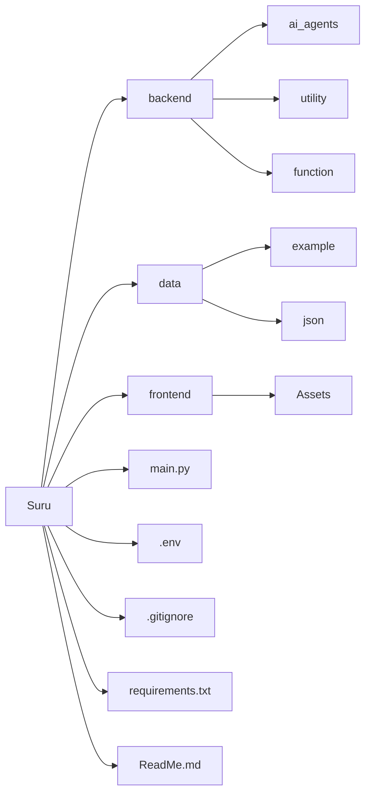

# Suru Assistance 🤖

**Suru** is your intelligent personal assistant designed to help you manage everyday tasks effortlessly. From organizing your schedule and setting reminders to assisting with work and offering useful suggestions, Suru AI is built to make your daily life smarter and more productive. With its intuitive design and wide range of functionalities, you can rely on Suru AI to perform actions quickly, efficiently, and with ease.


## ✅ Things will complete

- [x] Create a ```ReadMe.md``` file
- [x] Create a ```.gitignore``` file
- [x] Create a ```requirements.txt``` file
- [x] Open App
- [X] Check Weather
- [x] Chat GPT
- [x] Answer your question - Chat-Gpt/Gemini


## ❎ Things which in progress
-  Create a project structure
-  Create a file structure
-  Create a basic UI using Tkinter/Figma/Handmade Logo


## ❌ Pending Things
- [ ] Face Recognition
- [ ] Add example files
- [ ] Add license information
- [ ] Create a basic structure of the project
- [ ] Create a basic command line interface
- [ ] Create a basic API interface
- [ ] Create a basic database interface
- [ ] Create a basic file interface
- [ ] Create a basic email interface
- [ ] Create a basic web scraping interface
- [ ] Create a basic web browser interface
- [ ] Create a basic web server interface

## Features
| **Cross Platform support ---> (MacOS, Windows, Linux)**
- [ ] Open File
- [ ] Open sites
- [ ] Make Call
- [ ] Call Answer
- [ ] Control Home Appliance
- [ ] Voice detector 
- [ ] Make own note
- [ ] Application Control
- [ ] Reminds your work
- [ ] Schedule your work
- [ ] Control your system
- [ ] Speak in multi language
- [ ] Language translate
- [ ] File read/write/create
- [ ] Law Knowledge
- [ ] CA Knowledge
- [ ] Bank Knowledge - RBI Guideline
- [ ] Stock Market Knowledge 
- [ ] Basic health info
- [ ] Near area all hospital number
- [ ] Near area police number
- [ ] NFC action
- [ ] Remember Imp. Dates
- [ ] Tell which music is this
- [ ] Creak a jock
- [ ] Know the some poem 
- [ ] Access of e-mail
- [ ] Write an email
- [ ] Handle the instagram
- [ ] Do post
- [ ] Change assistance voice
- [ ] Change assistance name
- [ ] Change assistance theam

## Requirements
- Python 3.8 or higher
- API keys (OpenAI, Google Generative AI, Groq, etc.)
- Microphone (for voice input)


## 🚀 Quick Start

### 🪟 Windows

1. **Clone the repository:**
   ```powershell
   git clone https://github.com/DhruvJDev/Suru-A.I.git
   cd Suru-A.I
   ```

2. **Install Python dependencies:**
   ```powershell
   pip install -r requirements.txt
   ```

3. **Set up API keys:**
   Create a `.env` file in the project root and add your API keys:
   ```
   OPENAI_API_KEY=your_key_here
   GOOGLE_API_KEY=your_key_here
   GROQ_API_KEY=your_key_here
   ```

4. **Run the application:**
   ```powershell
   python main.py
   ```

### 🍎 macOS

1. **Clone the repository:**
   ```bash
   git clone https://github.com/DhruvJDev/Suru-A.I.git
   cd Suru-A.I
   ```

2. **Install PortAudio (required for PyAudio):**
   ```bash
   brew install portaudio
   ```
   *If you don't have Homebrew: [Install it here](https://brew.sh)*

3. **Install Python dependencies:**
   ```bash
   pip3 install -r requirements.txt
   ```

4. **Set up API keys:**
   Create a `.env` file in the project root and add your API keys:
   ```
   OPENAI_API_KEY=your_key_here
   GOOGLE_API_KEY=your_key_here
   GROQ_API_KEY=your_key_here
   ```

5. **Run the application:**
   ```bash
   python3 main.py
   ```
   *Grant microphone permissions when prompted*

### 🐧 Linux

1. **Clone the repository:**
   ```bash
   git clone https://github.com/DhruvJDev/Suru-A.I.git
   cd Suru-A.I
   ```

2. **Install system dependencies:**
   ```bash
   sudo apt update
   sudo apt install portaudio19-dev espeak
   ```

3. **Install Python dependencies:**
   ```bash
   pip3 install -r requirements.txt
   ```

4. **Set up API keys:**
   Create a `.env` file in the project root and add your API keys:
   ```
   OPENAI_API_KEY=your_key_here
   GOOGLE_API_KEY=your_key_here
   GROQ_API_KEY=your_key_here
   ```

5. **Run the application:**
   ```bash
   python3 main.py
   ```

## 🔥 Firebase Setup (Optional)

The app can fetch application mappings from Firebase for the "open app" feature. Firebase setup is **completely optional** - the app works without it.

- **With Firebase:** Users who clone the repo can use the public read-only Firebase database (no setup required)
- **Without Firebase:** You can set up your own Firebase project following [FIREBASE_SETUP.md](FIREBASE_SETUP.md)

The app automatically handles Firebase connectivity and continues working regardless of Firebase status.


## Contributing
We welcome contributions! Please read our [contributing guidelines](CONTRIBUTING.md) for more information.


## License
This project is licensed under the MIT License. See the [LICENSE](LICENSE) file for details.


## 🛠️ Troubleshooting

### Windows
- **PyAudio fails to install**: Download wheel from [here](https://www.lfd.uci.edu/~gohlke/pythonlibs/#pyaudio) for older Python versions
- **Microphone not detected**: Check **Settings > Privacy > Microphone** permissions

### macOS
- **PyAudio fails**: Ensure Homebrew and PortAudio are installed: `brew install portaudio`
- **Voice not working**: Reset voice settings: `defaults delete com.apple.speech.voice.prefs` then reboot
- **Microphone access**: Grant permission in **System Settings > Privacy & Security > Microphone**
- **Apps won't open**: Use exact app names as they appear in Applications folder (case-sensitive)

### Linux
- **No voice output**: Install espeak: `sudo apt install espeak`
- **PyAudio issues**: Install dependencies: `sudo apt install portaudio19-dev python3-pyaudio`


## 🗂️ File Structure 

